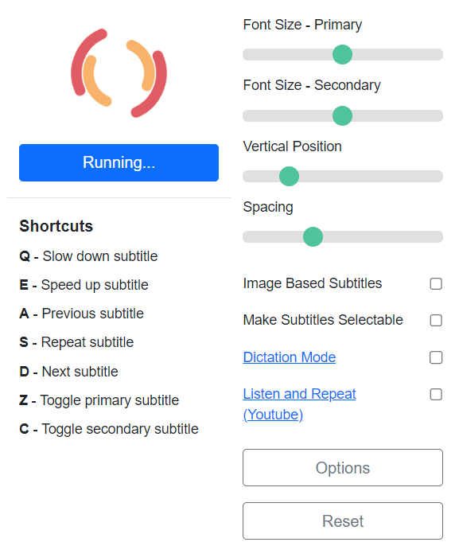

# Netflix Subtitle Translator
This translator is made for  [Netflix](https://netflix.com/) users who are unable to open up certain language of subtitles when their IP address is at foreign country.

Please be mindful since this translator may not always translate the subtitle correctly since the translator being used is [Google Translate](https://translate.google.com/).

<i>Consider watching Netflix videos in fullscreen for an optimal viewing experience while using this translator, and disable secondary subtitles for better translation results.

Only work for Netflix Video.</i>

## Prerequisites
- [Netflix Billingual Subtitles](https://chrome.google.com/webstore/detail/netflix-bilingual-subtitl/ociifpecaephgjmjlkepjmiemcjidbgn)

## Instruction to download

1. Download <i>Netflix Billingual Subtitles</i> from <i>Google Extension Webstore</i>
2. Allow <i>Netflix Billingual Subtitles</i> to run in background 

3. Select the subtitles you want to translate in the <strong> Subtitles Column </strong> since this translator will only translate the selected subtitles in <strong>Subtitles</strong> only 

4. Download this repo as ``ZIP file`` and extract it
5. Enable ``Google Extension Developer Mode``
6. Select ``Load Unpacked``, then select the folder ``netflix-extension-main``
7. Enable <i>Subtitle Translator</i> access to your browser
8. Open up extension drop down list and activate it

## Features
- <strong>Checkbox</strong> that labelled with ``Main Subtitle`` allows user to control the visibility of the original subtitle
- ``Enable`` and ``Disable`` <strong>buttons </strong>allow user to control the visibility of translated subtitle
- ``Target Language`` <strong>drop down list </strong>allows user to select which language the original subtitle will be translated to